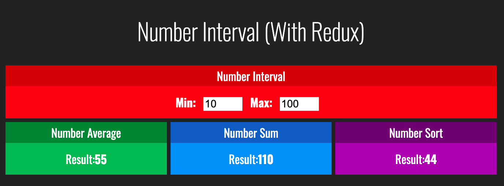

<h1 align="center">
 
NUMBER INTERVAL using React and Redux
</h1>

Small APP about number interval between numbers having REACT and REDUX

  

## Features
- **React Js**
- **Redux**

## Getting started

- run the command: npm i
- run the command: npm run start